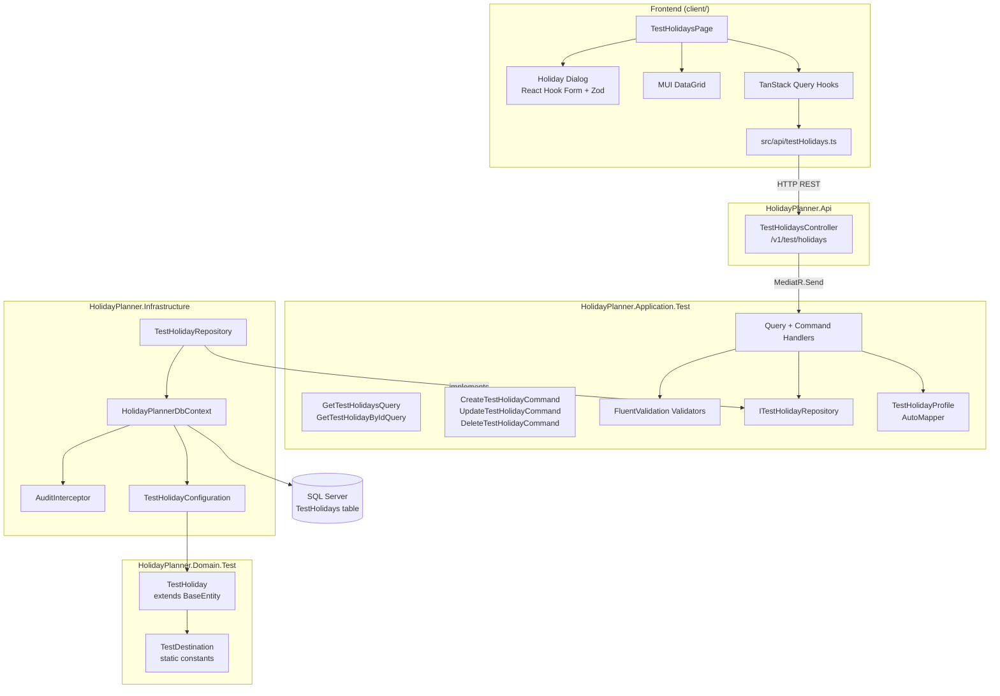
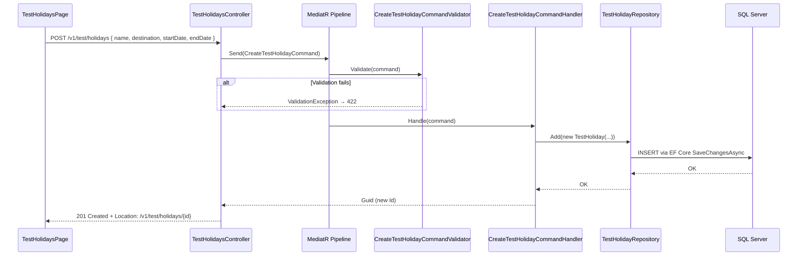

# Feature Architecture: Test Holiday CRUD

**Date**: 2026-05-10
**Status**: Draft 1
**Derived from**: `features/test-holiday-crud_spec2026-05-10.md`

---

## Agreed architecture

This feature implements a full-stack CRUD operation for a `TestHoliday` entity, spanning all architectural layers. Its primary purpose is to validate that every layer of the stack — MediatR pipeline, FluentValidation behavior, domain model, EF Core repository, AutoMapper projection, REST API, and React/MUI frontend — is correctly wired together.

All types introduced by this feature (domain entities, application commands/queries/DTOs/handlers/validators, infrastructure repositories and configuration, and the API controller) MUST be prefixed with `Test` and MUST live under a `Test` namespace segment within their respective project. This makes the entire feature identifiable and removable as a single operation.

`HolidayPlannerDbContext`, `AuditInterceptor`, and EF Core registration are NOT prefixed — they are permanent infrastructure that will be shared by all future features.

The five allowed destination values (Mexico, Japan, New Zealand, Iceland, Scotland) MUST be defined as constants in a `TestDestination` static class in the Domain layer. Neither the backend nor the frontend may accept any value outside this set.

The domain rule that `EndDate` must be after `StartDate` is enforced in the FluentValidation command validators, not in the domain entity — this is intentional for a test entity where simplicity is preferred over deep domain modelling.

EF Core migrations manage the `TestHolidays` table schema. The `AuditInterceptor` sets `CreatedOn` on insert and `ModifiedOn` on every update by writing directly to `entry.Property(nameof(BaseEntity.CreatedOn)).CurrentValue` — no domain methods or `InternalsVisibleTo` grants are required.

---

## Flow diagram

### Component and layer structure

### Command request flow (Create as example)

---

## Mandated behaviours

### Domain layer (`HolidayPlanner.Domain.Test`)

- `TestHoliday` MUST inherit `BaseEntity` and MUST NOT define its own `Id`, `CreatedOn`, or `ModifiedOn` fields.
- `TestDestination` MUST be a `static class` with `public const string` members for each of the five values. No C# enum.
- The domain layer MUST NOT reference any application, infrastructure, or API project.

### Application layer (`HolidayPlanner.Application.Test`)

- Every command and query MUST have exactly one handler. No handler handles more than one request type.
- `ITestHolidayRepository` MUST be defined in the Application layer, not Infrastructure.
- `CreateTestHolidayCommandValidator` and `UpdateTestHolidayCommandValidator` MUST validate: Name is not empty, Destination is one of the five `TestDestination` constants, EndDate is strictly after StartDate.
- Handlers MUST NOT access `HolidayPlannerDbContext` directly. All persistence MUST go through `ITestHolidayRepository`.
- `TestHolidayProfile` MUST define the mapping from `TestHoliday` → `TestHolidayDto`. No mapping logic belongs in handlers.
- Query handlers MUST use `AsNoTracking()` projections. They MUST NOT load full entity graphs when a DTO projection suffices.
- `DeleteTestHolidayCommandHandler` MUST throw `NotFoundException` (from `HolidayPlanner.Domain.Common.Exceptions`) if the entity does not exist.
- `UpdateTestHolidayCommandHandler` MUST throw `NotFoundException` if the entity does not exist.

### API layer (`HolidayPlanner.Api.Controllers.Test`)

- `TestHolidaysController` MUST NOT contain any business logic. It dispatches to MediatR and maps the HTTP response only.
- Routes MUST follow the pattern `api/v1/test/holidays` with the `[ApiVersion("1.0")]` attribute.
- `POST /` MUST return `201 Created` with a `Location` header pointing to the new resource.
- `PUT /{id}` and `DELETE /{id}` MUST return `204 No Content`.
- `GET /` MUST return `200 OK` with the collection (empty array if no data, never 404).
- `GET /{id}` MUST return `404 Not Found` via the `GlobalExceptionHandler` if the entity does not exist.

### Infrastructure layer (`HolidayPlanner.Infrastructure`)

- `TestHolidayRepository` MUST implement `ITestHolidayRepository`. It MUST NOT expose `DbContext` or `IQueryable` to callers.
- `TestHolidayConfiguration` MUST set the table name to `TestHolidays`, configure `Name` as required with max length 200, configure `Destination` as required with max length 50.
- `HolidayPlannerDbContext` MUST include `DbSet<TestHoliday> TestHolidays`.
- `AuditInterceptor` MUST override `SavingChangesAsync` and set `CreatedOn` for `EntityState.Added` entries and `ModifiedOn` for `EntityState.Added` and `EntityState.Modified` entries, using `DateTimeOffset.UtcNow`.
- EF Core SQL Server registration MUST read the connection string from `ConnectionStrings:DefaultConnection` in configuration.
- A migration MUST be created and applied before the feature is considered done.
- `DependencyInjection.cs` MUST register `ITestHolidayRepository` → `TestHolidayRepository` as `Scoped`.

### Frontend (`client/src/`)

- The API client (`src/api/testHolidays.ts`) MUST be the only place HTTP calls are made. TanStack Query hooks MUST NOT call fetch directly.
- TypeScript types `TestHoliday`, `CreateTestHolidayRequest`, and `UpdateTestHolidayRequest` MUST match the backend DTO shapes exactly.
- The Zod schema for the create/edit form MUST mirror the backend validation rules: Name required, Destination in the five allowed values, EndDate after StartDate.
- The Destination field MUST be rendered as an MUI `Select` dropdown. Free-text entry MUST NOT be possible.
- The page MUST handle loading, error, and empty states explicitly — no assumed success.
- The page MUST NOT be linked from any permanent navigation element.

---

## Implementation sequence

1. **Domain** — `TestHoliday` entity, `TestDestination` constants
2. **Infrastructure (shared)** — `HolidayPlannerDbContext`, `AuditInterceptor`, EF Core SQL Server DI registration, `TestHolidayConfiguration`, migration
3. **Application** — `ITestHolidayRepository`, `TestHolidayDto`, `TestHolidayProfile`, all five command/query + handler pairs, both validators
4. **Infrastructure (feature)** — `TestHolidayRepository` implementation
5. **API** — `TestHolidaysController`
6. **Frontend** — API client types and functions, TanStack Query hooks, `TestHolidaysPage`, form dialog, DataGrid
7. **Tests** — unit tests for handlers and validators; integration tests for the API endpoints against the docker-compose SQL Server instance
